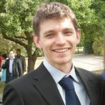

<!-- BIO SECTION -->

	<!-- BIO IMAGE -->
	

		
	

	
	<!-- BIO TEXT -->
	

		

			Marco Volino is a Senior Lecturer in Computer Vision and Graphics at the <a href="https://www.surrey.ac.uk/" target="_blank">University of Surrey</a>’s <a href="https://www.surrey.ac.uk/centre-vision-speech-signal-processing" target="_blank">Centre for Vision, Speech and Signal Processing</a> and a AI fellow at the <a href="https://www.surrey.ac.uk/ai" target="_blank">Surrey Insititue for People-Centred AI</a>, where he leads research and teaching at the intersection of computer vision, computer graphics and machine learning for the creative industry applications. 
			His work develops new methods for volumetric video, digital humans, neural rendering, light fields, 3D reconstruction, performance capture and immersive media production, with applications across film, broadcast, games, virtual production and extended reality.		
		

		

			Marco’s research bridges fundamental advances in visual computing with production-facing systems for next-generation content creation. 
			He has contributed to major research and innovation projects with creative and technology partners including BBC Research & Development, Epic Games, Humain Studios, Foundry, Figment Productions and the CoSTAR National Lab, translating research in multi-camera capture, free-viewpoint video, 4D human performance and AI-enabled media tools into workflows for the creative sector.		
		

		

			<a href="{{site.url}}/research/#publications">His publications</a> span leading venues in computer vision, graphics and immersive media, including CVPR, ECCV, ICCV, 3DV, and IEEEVR. 
			Recent work includes Gaussian splatting, digital human reconstruction, neural implicit models, super-resolution 3D human shape, object-based media and controllable avatar synthesis.		
		

		

			<a href="{{ site.url }}/teaching/">Alongside his research, Marco is committed to developing the next generation of visual computing talent</a>. 
			He has led the development and delivery of the second year undergraduate module "Computer Vision and Graphics" and the MSc in AI moudule "AR, VR and the Metaverse" as well as superving both undergraduate and MSc projects, connecting students with emerging technologies in immersive media, spatial computing and AI-enabled creative production.
		

		

			Marco also plays an active leadership role in the visual media research community, including service as CVMP Conference Co-Chair, CVMP Steering Committee member, BMVC Area Chair and co-organiser of the DynaVis workshop series on dynamic scene reconstruction. 
			Through his research, teaching and community leadership, he works to advance visual computing technologies that shape how future creative content is captured, represented, generated and experienced.
		

		 
	

## News 


	<ul>
		<li><b>{{article.date | date: "%Y/%m" }}</b> - {{article.title}}</li>
	</ul>


